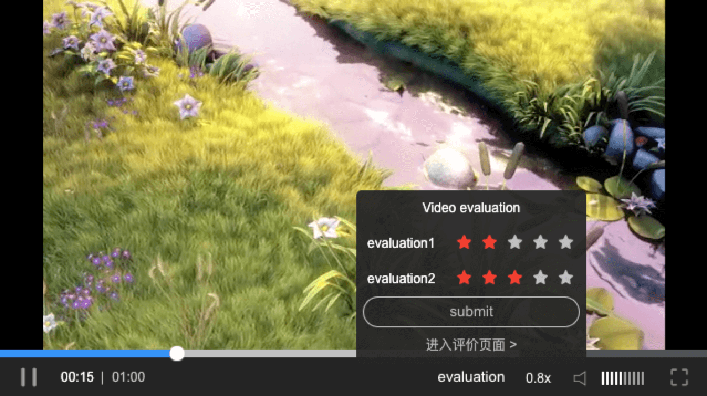

# clappr-appraise-star

```
<script type="text/javascript" src="./js/clappr-appraise-star.js"></script>
```

```
var player = new Clappr.Player({
    source: "http://clips.vorwaerts-gmbh.de/big_buck_bunny.mp4",
    poster: "https://upload.wikimedia.org/wikipedia/commons/thumb/2/28/HelloWorld.svg/512px-HelloWorld.svg.png",
    parentId: "#player",
    hideMediaControl: false,
    plugins: [AppraiseStar.default],
    appraiseStarConfig: {
		buttonText: 'evaluation',       // 控制台button文案
		icon: '',
		title: 'Video evaluation',      // 标题
		detailLink: '',                 // 详情链接
		submitButtonText: 'submit',
		errorInfo: '您的评价对我们很重要',
		successInfo: '提交成功',
		starObj: [
		{
			id: 0,
			name: 'evaluation1',
			star: 0 // 默认星
		},
		{
			id: 1,
			name: 'evaluation2',
			star: 0
		}
		],
		defaultStatus: 1,  // 设置一个默认状态: 1 已提交过, 0 正常
		callbackFn: function (starObj, successCallback, errorCallback) {
			console.log(starObj);
			setTimeout(function () {
				successCallback();
			}, 2000);
		}
    },
});
```

